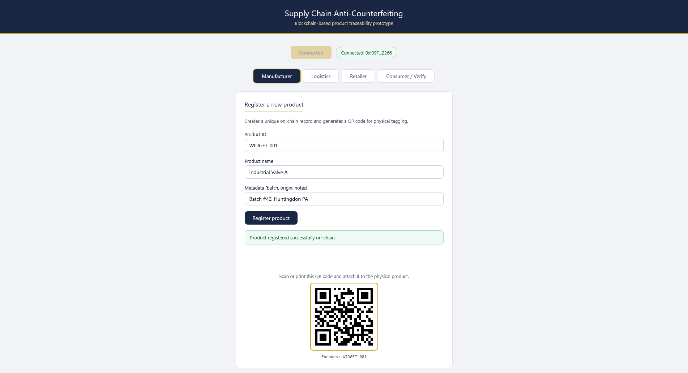
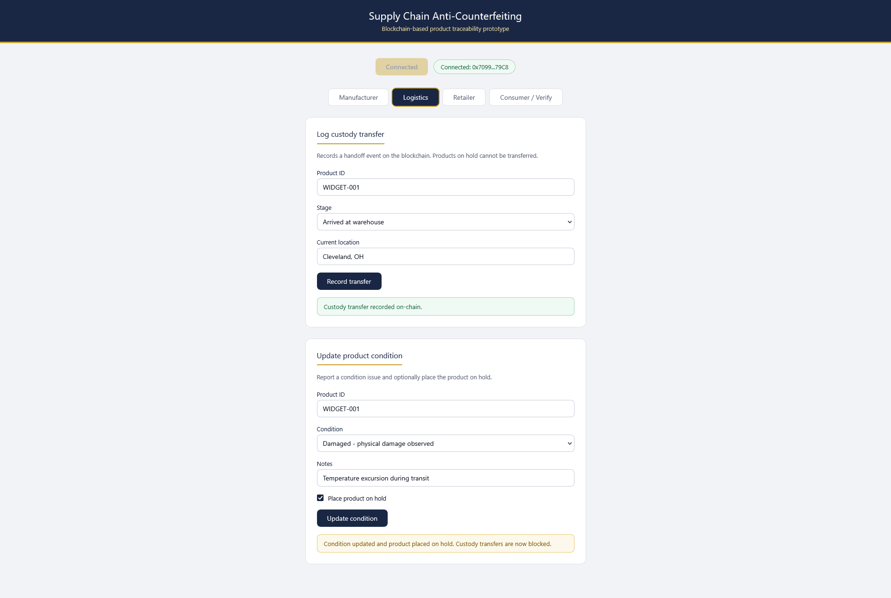
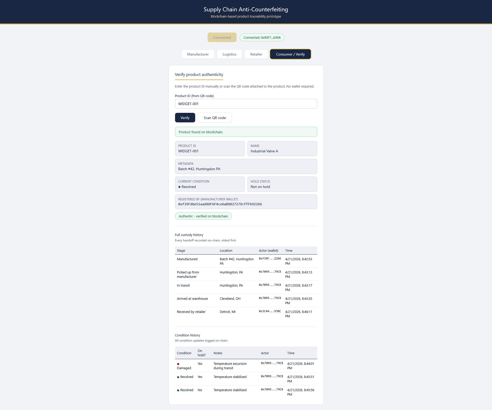

# Blockchain-Based Supply Chain Anti-Counterfeiting Prototype

This is a prototype I made demonstrating how blockchain technology can be used to combat counterfeit products in supply chains. It was built for my capstone research project at Juniata College. It's fairly simple, and I built it with Solidity, Hardhat, and ethers.js.

---

## Overview

This system assigns each physical product a unique on-chain identity. Every time a product changes hands (say from manufacturer to logistics to retailer) that event is recorded as an immutable entry on a local Ethereum blockchain. Consumers can scan a QR code attached to the product and instantly verify its full chain of custody.

The core anti-counterfeiting guarantee comes from the blockchain itself: records cannot be altered or deleted after they are written, and every write operation must be cryptographically signed by a real wallet. A counterfeit product either has no blockchain record, or its record will not match the expected supply chain history.

This project was developed as part of a capstone research project exploring the intersection of blockchain technology and supply chain management.

---

## Features

- **Product registration** — manufacturers register products on-chain with a unique ID, name, and metadata
- **QR code generation** — each registered product gets a scannable QR code for physical tagging
- **Custody tracking** — logistics providers and retailers log handoff events, each signed by their wallet
- **Condition reporting** — any actor can flag a product as damaged or contaminated and place it on hold
- **Hold enforcement** — products placed on hold are blocked from further custody transfers at the smart contract level, not just the UI
- **Authenticity verification** — consumers can verify a product and view its full history without a wallet
- **QR code scanning** — the Consumer tab supports live camera scanning to auto-fill the product ID

---

## Tech Stack

| Layer | Technology |
|---|---|
| Smart contract | Solidity 0.8.28 |
| Local blockchain | Hardhat 3 (built-in network) |
| Deployment | Hardhat Ignition |
| Frontend | HTML, CSS, vanilla JavaScript |
| Blockchain library | ethers.js v6 |
| QR code generation | qrcodejs |
| QR code scanning | jsQR |
| Wallet | MetaMask |

---

## Prerequisites

Before running this project, install the following:

- [Node.js](https://nodejs.org) v20 or higher (LTS recommended)
- [Git](https://git-scm.com)
- [MetaMask](https://metamask.io) browser extension
- A code editor 

---

## Installation

Clone the repository and install dependencies:

```bash
git clone https://github.com/rfenchak/blockchain-anticounterfeit.git
cd blockchain-anticounterfeit
npm install
```

---

## Running the Project

### Option A: Startup script (Windows)

Double-click `start.bat` in the project folder. It will automatically start the blockchain node, deploy the contract, and launch the web server. Then open your browser to:

```
http://localhost:3000
```

### Option B: Manual startup

Open two terminal windows in the project folder.

**Terminal 1 — start the local blockchain:**
```bash
npx hardhat node
```
Leave this running. You will see 20 funded test accounts listed.

**Terminal 2 — deploy the contract and start the server:**
```bash
npx hardhat ignition deploy ignition/modules/Lock.ts --network localhost
npx serve .
```

Then open `http://localhost:3000` in your browser.

> **Important:** Every time you restart the Hardhat node, the blockchain resets and you must redeploy the contract. Any previously registered products will be wiped.

---

## MetaMask Setup

MetaMask is required to sign transactions as a supply chain actor. The Consumer / Verify tab works without MetaMask.

### Add the local Hardhat network

In MetaMask, go to **Settings → Networks → Add a network** and enter:

| Field | Value |
|---|---|
| Network name | Hardhat Local |
| RPC URL | http://127.0.0.1:8545 |
| Chain ID | 31337 |
| Currency symbol | ETH |

### Import test accounts

The Hardhat node always generates the same accounts with the same private keys. Import them into MetaMask using **Add account → Import account**:

| Role | Private key |
|---|---|
| Manufacturer | `0xac0974bec39a17e36ba4a6b4d238ff944bacb478cbed5efcae784d7bf4f2ff80` |
| Logistics | `0x59c6995e998f97a5a0044966f0945389dc9e86dae88c7a8412f4603b6b78690d` |
| Retailer | `0x5de4111afa1a4b94908f83103eb1f1706367c2e68ca870fc3fb9a804cdab365a` |
You don't need a Verify account as it is read only.

> These are public test keys used by every Hardhat installation. Never use them on any real network or send real funds to them.

---

## Usage

### 1. Register a product (Manufacturer)

Switch MetaMask to the Manufacturer account. On the **Manufacturer** tab, fill in:
- **Product ID** — a unique identifier, e.g. `WIDGET-001`
- **Product name** — e.g. `Industrial Valve A`
- **Metadata** — batch number, origin, etc.

Click **Register product** and confirm the transaction in MetaMask. A QR code will appear — this encodes the product ID and can be printed and attached to the physical item.

### 2. Log a custody transfer (Logistics)

Switch MetaMask to the Logistics account. On the **Logistics** tab, enter the same product ID, select a stage, and enter a location. Click **Record transfer** and confirm.

### 3. Confirm receipt (Retailer)

Switch MetaMask to the Retailer account. On the **Retailer** tab, enter the product ID and store location. Click **Confirm receipt**.

### 4. Verify authenticity (Consumer)

On the **Consumer / Verify** tab, enter the product ID or click **Scan QR code** to use your camera. No MetaMask required. The full custody history and condition status will be displayed.

### 5. Report a condition issue

Any actor can use the **Update product condition** card on their tab to flag a product as damaged, contaminated, or under inspection. Checking **Place product on hold** will block any further custody transfers at the smart contract level until the hold is released.

---

## Screenshots

### Product registration and QR code generation


### Custody transfer recorded on-chain with a hold implemented


### The hold prevents further custody transfer


### Consumer verification with full history


---

## Project Structure

```
blockchain-anticounterfeit/
├── contracts/
│   └── ProductRegistry.sol     # Main smart contract
├── ignition/
│   └── modules/
│       └── Lock.ts             # Deployment module
├── test/                       # Automated tests (future work)
├── artifacts/                  # Compiled contract output (auto-generated)
├── index.html                  # Frontend application
├── start.bat                   # Windows startup script
├── hardhat.config.ts           # Hardhat configuration
├── package.json
└── README.md
```

---

## Smart Contract Reference

**`ProductRegistry.sol`** — the core of the system. Deployed at `0x5FbDB2315678afecb367f032d93F642f64180aa3` on the local Hardhat network.

### Functions

| Function | Type | Description |
|---|---|---|
| `registerProduct(productId, name, metadata)` | write | Registers a new product and records the initial custody event |
| `transferCustody(productId, stage, location)` | write | Logs a custody handoff; reverts if product is on hold |
| `updateCondition(productId, condition, onHold, notes)` | write | Updates product condition and optional hold status |
| `getProduct(productId)` | view | Returns product details and current condition |
| `getHistory(productId)` | view | Returns full custody event history |
| `getConditionHistory(productId)` | view | Returns full condition update history |
| `isAuthentic(productId)` | view | Returns true if product exists on chain |

### Key design factors

**Hold enforcement in the contract, not the UI.** The `require(!products[productId].onHold, ...)` check in `transferCustody` means the blockchain itself rejects transfers for held products. Even if someone bypassed the frontend and called the function directly, the hold would still be enforced.

**`msg.sender` as identity.** Each wallet address acts as the identity of a supply chain actor. The contract does not need usernames or passwords — the cryptographic signature on every transaction proves who made each update.

**Immutable event log.** Custody and condition events are appended to arrays and can never be removed or modified. This is the tamper-resistance property that makes blockchain valuable for anti-counterfeiting.

---

## Limitations and Future Work

This prototype is simplified for research purposes. A production system would address the following:

- **The physical-digital link problem** this system cannot prevent someone from copying a QR code onto a fake product. Hardware solutions such as NFC tags with physically unclonable functions (PUFs) would strengthen this link.
- **Role-based access control**: currently any wallet can call any function. A production system would restrict registration to verified manufacturers and custody updates to authorized supply chain actors.
- **Persistent network**: this runs on a local blockchain that resets on restart. A real deployment would use a persistent testnet or private permissioned network.
- **Scalability**: the Ethereum-based architecture used here has known throughput limitations. High-volume supply chains may require a Layer 2 solution or a purpose-built chain like Hyperledger Fabric.
- **Gas optimization**: storing strings on-chain is expensive in production. Product IDs and metadata would typically be hashed or stored off-chain with only a hash committed to the ledger.

---

## Research Context

This prototype was developed as part of a capstone research project on blockchain-based anti-counterfeiting in supply chains. It accompanies a literature review examining existing implementations, adoption challenges, and the physical-digital link problem.

---

## License

MIT License. This project is intended for educational and research purposes.
